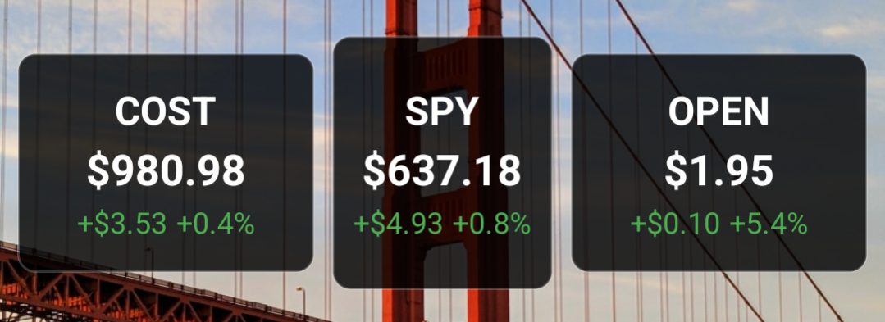

# Simple Stocks Widget

A clean, minimal Android widget app for displaying real-time stock prices on your home screen. Features both 2×1 and 1×1 widget sizes with automatic updates during market hours.

[Download apk](https://github.com/sidward35/simple-stocks-widget/releases/download/v1.2.1/xyz.smathur.simplestockswidget.v1.2.1.apk)



## Features

- **Clean Widget Design**: Minimalist widgets that blend perfectly with your home screen
- **Two Widget Sizes**: 2×1 (full info) and 1×1 (compact) widgets available
- **Real-time Data**: Fetches live stock prices using Finnhub API
- **Smart Battery Saving**: Only updates during market hours (6:30 AM - 1:00 PM PT, weekdays)
- **Demo Mode**: Works without API key using realistic demo data
- **Dark Mode Support**: Fully supports Android's dark/light theme switching
- **Options Support**: Supports major stocks and ETFs (AAPL, SPY, TSLA, NVDA, etc.)

## Installation

### From Source

1. **Clone the repository:**
   ```bash
   git clone https://github.com/yourusername/simple-stocks-widget.git
   cd simple-stocks-widget
   ```

2. **Open in Android Studio:**
   - File → Open → Select the project folder
   - Let Android Studio sync and build

3. **Get Finnhub API Key:**
   - Visit [Finnhub.io](https://finnhub.io) and create a free account
   - Copy your API key from the dashboard
   - Note: App works with demo data if no API key provided

4. **Build and Install:**
   - Connect your Android device or start an emulator
   - Click **Run** in Android Studio

### APK Release

Download the latest APK from the [Releases](https://github.com/yourusername/simple-stocks-widget/releases) page.

## Usage

1. **Setup API Key:**
   - Open the Simple Stocks Widget app
   - Enter your Finnhub API key
   - Set update interval (default: 5 minutes)
   - Click "Save Settings & Update Widgets"

2. **Add Widgets:**
   - Long press on your home screen
   - Select "Widgets"
   - Find "Simple Stocks Widget"
   - Choose 2×1 or 1×1 size
   - Configure with stock symbol (e.g., AAPL, SPY, TSLA)

3. **Supported Symbols:**
   - US Stocks: AAPL, GOOGL, MSFT, TSLA, NVDA
   - ETFs: SPY, QQQ, IWM, VTI
   - And many more major US securities

## Project Structure

```
SimpleStocksWidget/
├── app/
│   ├── src/
│   │   ├── main/
│   │   │   ├── java/xyz/smathur/simplestockswidget/
│   │   │   │   ├── MainActivity.kt                    # Main app settings screen
│   │   │   │   ├── StockWidgetProvider.kt            # 2x1 widget provider
│   │   │   │   ├── SmallStockWidgetProvider.kt       # 1x1 widget provider
│   │   │   │   ├── WidgetConfigActivity.kt           # 2x1 widget configuration
│   │   │   │   ├── SmallWidgetConfigActivity.kt      # 1x1 widget configuration
│   │   │   │   ├── StockUpdateService.kt             # Background update service
│   │   │   │   └── StockDataCache.kt                 # Data caching and management
│   │   │   ├── res/
│   │   │   │   ├── drawable/
│   │   │   │   │   ├── widget_background.xml         # Widget background styling
│   │   │   │   │   ├── ic_launcher_background_stock.xml
│   │   │   │   │   └── ic_launcher_foreground_stock.xml
│   │   │   │   ├── layout/
│   │   │   │   │   ├── widget_2x1_layout.xml         # 2x1 widget layout
│   │   │   │   │   └── widget_1x1_layout.xml         # 1x1 widget layout
│   │   │   │   ├── mipmap-anydpi-v26/
│   │   │   │   │   └── ic_launcher.xml               # Adaptive launcher icon
│   │   │   │   ├── values/
│   │   │   │   │   └── themes.xml                    # App theme configuration
│   │   │   │   └── xml/
│   │   │   │       ├── stock_widget_info.xml         # 2x1 widget configuration
│   │   │   │       └── small_stock_widget_info.xml   # 1x1 widget configuration
│   │   │   └── AndroidManifest.xml                   # App permissions and components
│   │   └── build.gradle.kts                          # App-level build configuration
│   └── build.gradle.kts                              # Project-level build configuration
├── gradle/
├── README.md
├── CONTRIBUTING.md
└── LICENSE
```

## Technical Details

### API Integration
- **Provider**: Finnhub.io free tier
- **Authentication**: Header-based (`X-Finnhub-Token`)
- **Endpoints**: `/quote` for real-time stock prices
- **Rate Limiting**: Respects free tier limits

### Battery Optimization
- **Market Hours Only**: Updates only during 6:30 AM - 1:00 PM Pacific Time on weekdays
- **Efficient Scheduling**: Uses Android's AlarmManager for background updates
- **Smart Caching**: Caches data locally to minimize API calls

### Architecture
- **MVVM Pattern**: Clean separation of UI and data logic
- **Jetpack Compose**: Modern Android UI toolkit for settings screens
- **Coroutines**: Asynchronous API calls and data processing
- **SharedPreferences**: Secure local storage for API keys and settings

## Requirements

- **Android 8.0 (API 26)** or higher
- **Internet connection** for real-time data
- **Finnhub API key** (optional - works with demo data)

## Permissions

- `INTERNET`: Fetch stock data from API
- `WAKE_LOCK`: Ensure background updates complete
- `RECEIVE_BOOT_COMPLETED`: Resume updates after device restart

## Contributing

See [CONTRIBUTING.md](CONTRIBUTING.md) for guidelines on contributing to this project.

## License

This project is licensed under the GNU GPL v3.0 License - see the [LICENSE](LICENSE) file for details.

## Acknowledgments

- **Finnhub.io** for providing free stock market data
- **Material Design** for UI/UX guidelines
- **Android Jetpack** for modern development tools

## Support

If you find this project useful, consider:
- ⭐ Starring the repository
- 🐛 Reporting bugs via GitHub Issues
- 💡 Suggesting features via GitHub Issues
- 🔧 Contributing improvements via Pull Requests

## Disclaimer

This app is for informational purposes only. Stock data may be delayed and should not be used as the sole basis for investment decisions. Always consult with financial professionals before making investment choices.
